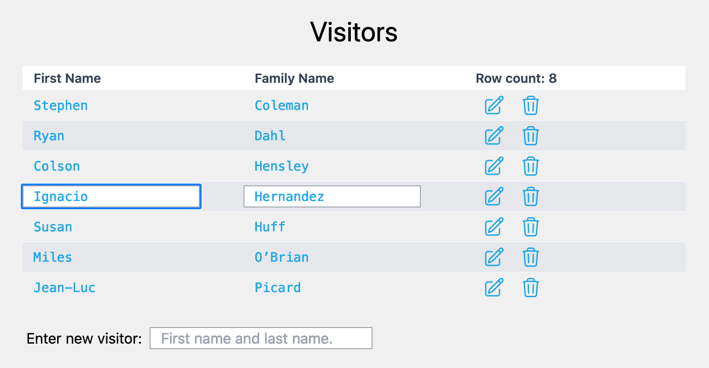

# Deno Fresh Demo

This demo application is based on Deno and Fresh. Deno is a Javascript runtime, which is meant to be an improvement on NodeJS. Fresh is a new web framework built on Deno.

This demo displays a table called Visitors. Each row of the table displays a first name and a family name, followed by an edit button and a delete button.

Table data is saved in a Key/Value database, Denokv.

Tailwind, a CSS framework, is used for styling.



## Installation

To install Deno on Mac or Linux, open a terminal window and run:

<pre>
curl -fsSL https://deno.land/install.sh | sh</pre>

In Windows PowerShell you can run:

<pre>
irm https://deno.land/install.ps1 | iex</pre>

[Reference](https://docs.deno.com/runtime/getting_started/installation/)

To create a Fresh application:

<pre>
$ deno run -A -r https://fresh.deno.dev 

 🍋 Fresh: The next-gen web framework. 

Project Name: my-demo
Let's set up your new Fresh project.

Do you want to use a styling library? [y/N] Y

1. tailwindcss (recommended)
2. Twind

Which styling library do you want to use? [1] 1
Do you use VS Code? [y/N] Y
The manifest has been generated for 5 routes and 1 islands.

Project initialized!

Enter your project directory using cd my-demo.
Run deno task start to start the project. CTRL-C to stop.

Stuck? Join our Discord https://discord.gg/deno 

Happy hacking! 🦕
</pre>

## Clone this Demo

To clone this demo, open a terminal window and run the following command:

<pre>
git clone git@github.com:Indrikoterio/deno-fresh-demo.git</pre>

Move to the newly created folder:

<pre>cd deno-fresh-demo</pre>

Start the server running:

<pre>deno run start</pre>

You will see:

```
Task start deno run -A --watch=static/,routes/,api/,api/visitors/ --unstable-kv dev.ts
Watcher Process started.
The manifest has been generated for 4 routes and 3 islands.

 🍋 Fresh ready 
    Local: http://localhost:8000/

```

Open your browser to localhost:8000 to view the Visitor table.

## Developer

deno-fresh-demo was developed by Cleve (Klivo) Lendon.

## Contact

To contact the developer, send email to indriko@yahoo.com .<br>
Comments, suggestions and criticism are welcomed.

## History

First release, October 2024.

## License

Use this source code as you wish and at your own risk.


